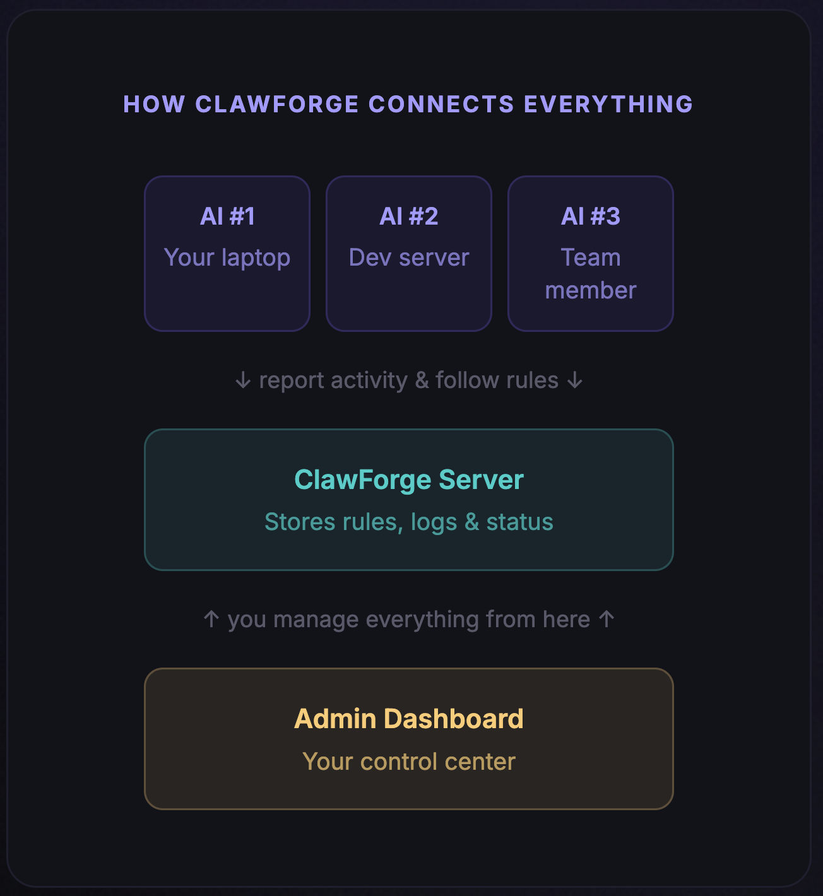

<p align="center">
  
</p>

<h1 align="center">ClawForge</h1>

<p align="center">
  
</p>

<p align="center">
  <strong>One dashboard to govern all your AI assistants.</strong>
</p>

<p align="center">
  ClawForge is the admin layer for <a href="https://github.com/openclaw/openclaw">OpenClaw</a>. It gives organizations centralized control over authentication, tool policies, skill governance, audit trails, and a remote kill switch — across every OpenClaw instance in the fleet.
</p>

---

<p align="center">
  
</p>

## Features

- **Centralized Policy Enforcement** — Define tool allow/deny lists and enforcement profiles from one place
- **Skill Governance** — Employees submit skills for admin review; only approved skills run in production
- **Audit Trail** — Every tool call, session, and LLM interaction is logged and queryable
- **Kill Switch** — Instantly disable all AI tool access across the entire org in an emergency
- **SSO / OIDC** — Okta, Auth0, Entra ID, or any OIDC provider, alongside email/password auth
- **Enrollment Tokens** — Generate invite tokens to onboard new users without SSO
- **Heartbeat Monitoring** — Know which instances are online and what policy version they're running
- **`/clawforge-status`** — Users can see their auth state, org, policy version, and kill switch status

## Quick Start

```bash
git clone https://github.com/ClawForgeAI/clawforge.git
cd clawforge
docker compose up --build
```

Once running:

- **Admin Console** — [localhost:4200](http://localhost:4200)
- **API** — [localhost:4100](http://localhost:4100)
- **Login** — `admin@clawforge.local` / `clawforge`

> For manual setup, SSO configuration, and connecting an OpenClaw gateway, see the [Setup Guide](docs/setup.md).

## Documentation

| Guide | Description |
| --- | --- |
| [Setup Guide](docs/setup.md) | Docker, manual setup, SSO, connecting OpenClaw |
| [Architecture & How It Works](docs/architecture.md) | Package structure, core concepts, data flows, database schema |
| [API Reference](docs/api-reference.md) | Every endpoint with request/response examples |
| [E2E Onboarding Guide](docs/e2e-guide.md) | Full walkthrough from zero to managed fleet |
| [Configuration](docs/configuration.md) | Plugin config, server env vars, admin console env vars |
| [Roadmap](docs/roadmap.md) | What's next for ClawForge |

## Contributing

Contributions are welcome! Please open an issue or submit a pull request.

## License

MIT
